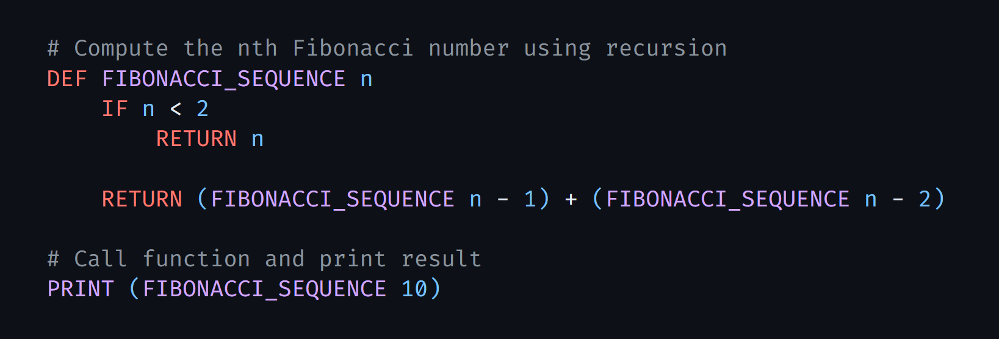

# LIN Programming language

Programming language written in typescript, inspired by python and IT IS MOSTLY UPPERCASE! 

LIN is turning complete language, meaning you can write any program in it, but I am not sure why you would want to do that. Due not having standard library, or way to link files.

I written the language for fun, and to learn more about how programming languages work.
